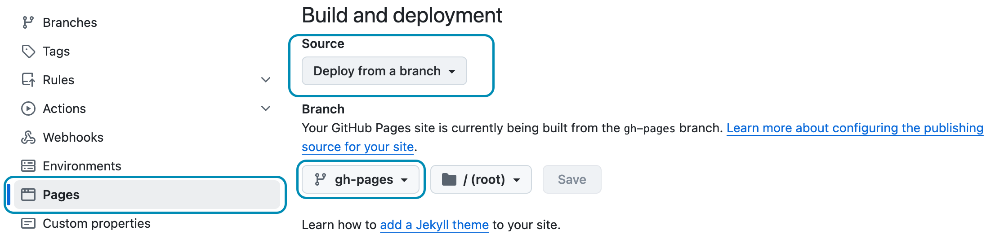

This chapters shows how to prepare your Hydejack site for a production build and deployment on 3rd party hosting providers.

0. this unordered seed list will be replaced by toc as unordered list
{:toc}

## Building locally
When building Hydejack it is important to set the environment variable `JEKYLL_ENV` to `production`.
Otherwise the output will not be minified. Building itself happens via Jekyll's `build` command.

~~~bash
$ JEKYLL_ENV=production bundle exec jekyll build
~~~

This will generate the finished static files in `_site`,
which can be deployed using the methods outlined in the [Jekyll Documentation][deploy].


## Building locally with latent semantic analysis
By default, related posts are simply the most recent posts.
Hydejack modifies this a bit, by showing the most recent posts of the same category or tag.
However, the results are still pretty "unrelated".
To provide better results, Jekyll supports [latent semantic analysis][lsa] via [`classifier-reborn`][crb]'s
[Latent Semantic Indexer][lsi]

To use the LSI, you first have to disable Hydejack's default behavior,
by setting `use_lsi: true` under the `hydejack` key in your config file.

~~~yml
# file: `_config.yml`
hydejack:
  use_lsi: true
~~~

Then, you have to run `jekyll build` with the `--lsi` flag:

~~~bash
$ JEKYLL_ENV=production bundle exec jekyll build --lsi
~~~


Note that this may take a long time.
Once it is finished, the generated static files will be located in the `_site` directory,
which can be deployed using the methods outlined in the [Jekyll Documentation][deploy].


## GitHub Pages

As of September 2024, you can deploy to GitHub Pages using a custom GitHub Action. 
You can read more about it in chapter [Deploy](deploy.md){:.heading.flip-title}.
{:.note}

If you're using the Starter Kit based on the `gh-pages` branch, or the `starter-kit-gh-pages` folder from the **PRO Version**,
all you have to do is push your repository:

```bash
$ git add .
$ git commit "Update content"
$ git push origin gh-pages
```

Make sure _Source_ is set to "Deploy from a branch" in the _Pages_ section of the repository settings, 
and that the branch you've pushed to matches the one selected in the dropdown:


{:.border}

Ensure these settings are set to continue using the GitHub Pages legacy pipeline.
{:.figcaption}

Continue with [Deploy](deploy.md){:.heading.flip-title}
{:.read-more}


[deploy]: https://jekyllrb.com/docs/deployment-methods/
[lsa]: https://en.wikipedia.org/wiki/Latent_semantic_analysis
[crb]: http://www.classifier-reborn.com/
[lsi]: http://www.classifier-reborn.com/lsi

*[LSI]: Latent Semantic Indexer
