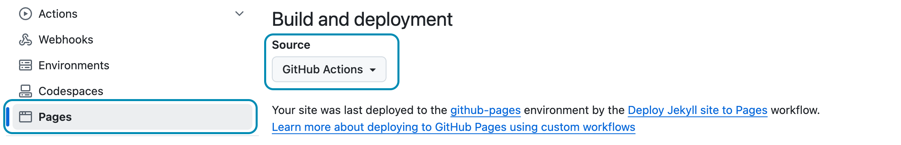

This chapter was added in 2024 with my recommendations on how to deploy Hydejack based on recent developments in GitHub Pages and other changes in the world of static site deployment. 

Note that the [Jekyll Documentation on Deployment][deploy] remains the best, most up-to-date resource for all things Jekyll deployment. 
These docs are my personal recipes with some extra steps that are mostly relevant to **PRO Customers**. 

0. this unordered seed list will be replaced by toc as unordered list
{:toc}


## GitHub Actions
You can deploy to GitHub Pages from a custom GitHub Action. It allows you to fully customize the build pipeline, set specific versions for Ruby and Jekyll and use any Jekyll plugin you may wish. 

To opt into the GitHub Actions pipelines, go to the repository's settings, find the *Pages* tab and ensure that the *Source* to "GitHub Actions":


{:.border}

Ensure these settings are set to opt in the GitHub Actions pipeline.
{:.figcaption}

As with the legacy GitHub Pages pipeline, deployments are triggered by pushing commits to a specific branch.
To set up the pipeline, create a YAML file in `.github/workflows` in the root of your repository with the following content:


~~~yml
# file: ".github/workflows/jekyll.yml"
# Sample workflow for building and deploying a Jekyll site to GitHub Pages
name: Deploy Jekyll site to Pages

on:
  # Runs on pushes targeting the default branch
  push:
    branches: [$default-branch] # You can change this to a specific branch (without the `$`)

  # Allows you to run this workflow manually from the Actions tab
  workflow_dispatch:

# Sets permissions of the GITHUB_TOKEN to allow deployment to GitHub Pages
permissions:
  contents: read
  pages: write
  id-token: write

# Allow only one concurrent deployment, skipping runs queued between the run in-progress and latest queued.
# However, do NOT cancel in-progress runs as we want to allow these production deployments to complete.
concurrency:
  group: "pages"
  cancel-in-progress: false

jobs:
  # Build job
  build:
    runs-on: ubuntu-latest
    steps:
      - name: Checkout
        uses: actions/checkout@v4
        with:
          fetch-depth: 0  # Fetch whole history for jekyll-last-modified-at plugin
      - name: Setup Ruby
        uses: ruby/setup-ruby@8575951200e472d5f2d95c625da0c7bec8217c42 # v1.161.0
        with:
          ruby-version: '3.1' # Not needed with a .ruby-version file
          bundler-cache: true # runs 'bundle install' and caches installed gems automatically
          cache-version: 0 # Increment this number if you need to re-download cached gems
      - name: Setup Pages
        id: pages
        uses: actions/configure-pages@v5
      - name: Build with Jekyll
        # Outputs to the './_site' directory by default
        run: bundle exec jekyll build --baseurl "${{ steps.pages.outputs.base_path }}"
        env:
          JEKYLL_ENV: production
      - name: Upload artifact
        # Automatically uploads an artifact from the './_site' directory by default
        uses: actions/upload-pages-artifact@v3

  # Deployment job
  deploy:
    environment:
      name: github-pages
      url: ${{ steps.deployment.outputs.page_url }}
    runs-on: ubuntu-latest
    needs: build
    steps:
      - name: Deploy to GitHub Pages
        id: deployment
        uses: actions/deploy-pages@v4
~~~


This example is based on [`actions/starter-workflows` repository](https://github.com/actions/starter-workflows/blob/main/pages/jekyll.yml) 
with one Hydejack-specific change applied:

The checkout step has been modified to pull the entire history of the repository. 
This allows the `jekyll-last-modified-at` plugin to generate accurate dates based on git history.

```yml
with:
  fetch-depth: 0  # Fetch whole history for jekyll-last-modified-at plugin
```

This GitHub Action works with any [Install](./install.md){:.heading.flip-title} of Hydejack that also runs on your local machine.

## Private Repo for PRO Customers
If you're a **PRO Customer** and followed the instructions during [Install](./install.md){:.heading.flip-title} to add the theme as a git dependency, your deploy pipeline must be authorized to pull from the private [`hydejack-pro` repository](https://github.com/hydecorp/hydejack-pro).

~~~ruby
# file: `Gemfile`
gem "jekyll-theme-hydejack", git: "https://github.com/hydecorp/hydejack-pro", tag: "pro/v9.2.1"
~~~

Make sure you are member of the ["PRO Customers" team](https://github.com/orgs/hydecorp/teams/pro-customers) on GitHub. If you've provided a GitHub handle during checkout you should have been automatically added, otherwise you can request an invite via [mail@hydejack.com](mailto:mail@hydejack.com).
{:.note}

In order for Bundle to fetch the private repository, an __environment variable__ named __`BUNDLE_GITHUB__COM`__ must be set to __`x-access-token:<GH_REPO_PAT>`__, where you replace `<GH_REPO_PAT>` with a 
GitHub [Personal Access Token](https://github.com/settings/tokens) (PAT) that has the "repo" permission.

If using a git dependency works for you, you can declutter your repository by deleting the `#jekyll-theme-hydejack` folder.
{:.note}

Most CI providers have a settings page that allows you can set environment variables. In the case of the GitHub Action above, the `BUNDLE_GITHUB__COM` variable is required during the "Setup Ruby" step. The modified step looks as follows:


~~~yml
- name: Setup Ruby
  uses: ruby/setup-ruby@8575951200e472d5f2d95c625da0c7bec8217c42 # v1.161.0
  with:
    ruby-version: '3.1' # Not needed with a .ruby-version file
    bundler-cache: true # runs 'bundle install' and caches installed gems automatically
    cache-version: 0 # Increment this number if you need to re-download cached gems
  env: #!!
    BUNDLE_GITHUB__COM: x-access-token:${{ secrets.GH_REPO_PAT }} #!!
~~~



[deploy]: https://jekyllrb.com/docs/deployment-methods/
