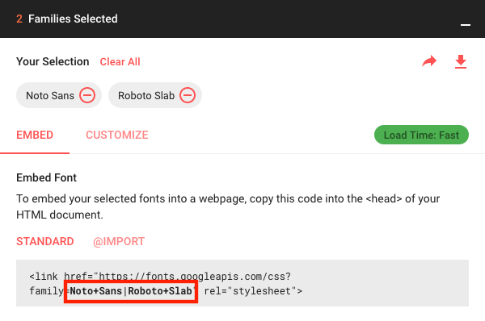
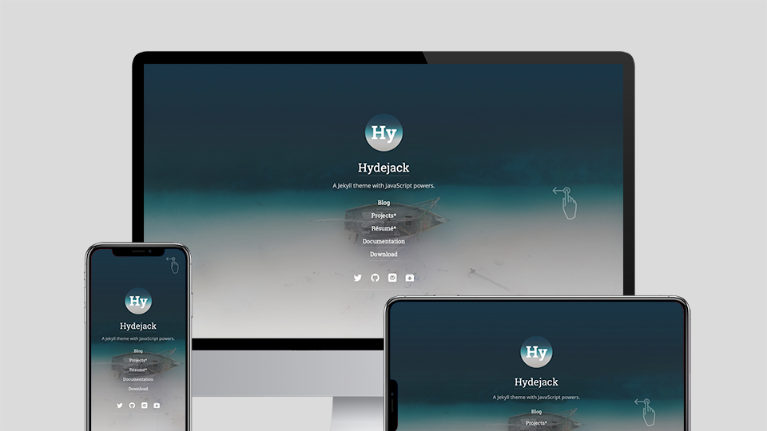

Here you should be able to find everything you need to know to accomplish the most common tasks when blogging with Hydejack.
Should you think something is missing, [please let me know](mailto:mail@qwtel.com).
Should you discover a mistake in the docs (or a bug in general) feel free to [open an issue](https://github.com/hydecorp/hydejack/issues) on GitHub.

While this manual tries to be beginner-friendly, as a user of Jekyll it is assumed that you are comfortable running shell commands and editing text files.
{:.note}


This document was created using Hydejack's print layout.
If you prefer to read it the documentation in your browser,
you can find it [here]({{ site.baseurl }}).
{:.note}

## Table of Contents
{:.no_toc}
0. this unordered seed list will be replaced by toc as unordered list
{:toc}


****---------------------------------------------------------------
                    INSTALL
----------------------------------------------------------------

## Install
How you install Hydejack depends on whether you [start a new site](#new-sites), 
or change the theme of [an existing site](#existing-sites).

0. this unordered seed list will be replaced by toc as unordered list
{:toc}

### New sites
For new sites, the best way to get started with Hydejack is via the Starter Kit. 
It comes with a documented config file and example content that gets you started quickly.

If you have a GitHub account, fork the [Hydejack Starter Kit][hsc] repository. 
Otherwise [download the Starter Kit][src] and unzip them somewhere on your machine.

If you bought the __PRO Version__ of Hydejack, use the contents of the `starter-kit` folder instead.

In addition to the docs here, you can follow the quick start guide in the Starter Kit.
{:.note}

You can now jump to [running locally](#running-locally).

You can now also [![Deploy to Netlify][dtn]][nfy]{:.no-mark-external} directly.
{:.note}

[hsc]: https://github.com/hydecorp/hydejack-starter-kit
[src]: https://github.com/hydecorp/hydejack-starter-kit/archive/v9.1.4.zip
[nfy]: https://app.netlify.com/start/deploy?repository=https://github.com/hydecorp/hydejack-starter-kit
[dtn]: https://www.netlify.com/img/deploy/button.svg


### Existing sites
If you have an existing site that you'd like to upgrade to Hydejack you can install the theme via bundler.
Add the following to your `Gemfile`:

~~~ruby
## file: `Gemfile`
gem "jekyll-theme-hydejack"
~~~

If you bought the __PRO Version__ of Hydejack, copy the `#jekyll-theme-hydejack` folder into the root folder of your site,
and add the following to your `Gemfile` instead:

~~~ruby
## file: `Gemfile`
gem "jekyll-theme-hydejack", path: "./#jekyll-theme-hydejack"
~~~

The folder is prefixed with a `#` to indicate that this folder is different from regular Jekyll content. 
The `#` char was choosen specifically because it is on of the four characters ignored by Jekyll by default (`.`, `_` , `#`, `~`).
{:.note}

In your config file, change the `theme` to Hydejack:

~~~yml
## file: `_config.yml`
theme: jekyll-theme-hydejack
~~~

Hydejack comes with a default configuration file that takes care most of the configuration,
but it pays off to check out the example config file in the Starter Kit to see what's available.

You can now jump to [running locally](#running-locally).

#### Troubleshooting
If your existing site combines theme files with your content (as did previous verisons of Hydejack/PRO),
make sure to delete the following folders:

- `_layouts`
- `_includes` 
- `_sass` 
- `assets`

The `assets` folder most likely includes theme files as well as your personal/content files. 
Make sure to only delete files that belong to the old theme!


### GitHub Pages
If you want to build your site on [GitHub Pages][ghp], check out the [`gh-pages` branch][gpb] in the Hydejack Starter Kit repo.

[ghp]: https://jekyllrb.com/docs/github-pages/
[gpb]: https://github.com/hydecorp/hydejack-starter-kit/tree/gh-pages

For existing sites, you can instead set the `remote_theme` key as follows:

```yml
## file: `_config.yml`
remote_theme: hydecorp/hydejack@v9.1.4
```

Make sure the `plugins` list contains `jekyll-include-cache` (create if it doesn't exist):
{:.note title="Important"}

```yml
## file: `_config.yml`
plugins:
  - jekyll-include-cache
```

To run this configuration locally, make sure the following is part of your `Gemfile`:

```ruby
## file: `Gemfile`
gem "github-pages", group: :jekyll_plugins
gem "jekyll-include-cache", group: :jekyll_plugins
```

Note that Hydejack has a reduced feature set when built on GitHub Pages. 
Specifically, using KaTeX math formulas doesn't work when built in this way.
{:.note}


### Running locally
Make sure you've `cd`ed into the directory where `_config.yml` is located.
Before running for the first time, dependencies need to be fetched from [RubyGems](https://rubygems.org/):

~~~bash
$ bundle install
~~~

If you are missing the `bundle` command, you can install Bundler by running `gem install bundler`.
{:.note}

Now you can run Jekyll on your local machine:

~~~bash
$ bundle exec jekyll serve
~~~

and point your browser to <http://localhost:4000> to see Hydejack in action.


[upgrade]: #upgrade


****---------------------------------------------------------------
                    UPGRADE
----------------------------------------------------------------

## Upgrade
This chapter shows how to upgrade Hydejack to a newer version. The method depends on how you've installed Hydejack.

0. this unordered seed list will be replaced by toc as unordered list
{:toc}

Before upgrading to v7+, make sure you've read the [CHANGELOG](../CHANGELOG.md){:.heading.flip-title},
especially the part about the [license change](../CHANGELOG.md#license-change)!
{:.note}

### Free version
Upgrading the free version of the theme is as easy as running

```bash
bundle update jekyll-theme-hydejack
```

### PRO Version

In v9, the structure of Hydejack PRO sites has changed. If you're looking to upgrade from v8 or earlier, 
check out [Installation for existing sites](./install.md#existing-sites) instead.
{:.note}

Buyers of the PRO version will find the files necessary for an upgrade in the `#jekyll-theme-hydejack` folder of the downloaded zip archive.
To upgrade, simply overwrite the existing theme folder in the root directory of your site with the new one, then run

```bash
bundle update jekyll-theme-hydejack
```

If you've modified any of Hydejack's files in `#jekyll-theme-hydejack`, your changes will most likely be overwritten
and you have to apply them again. Make sure you've made a backup before overwriting any files.
{:.note}

### GitHub Pages
When building on GitHub Pages, upgrading Hydejack is as simple as setting the `remote_theme` key in `_config.yml` to the desired version.

```yml
remote_theme: hydecorp/hydejack@v9.1.4
```

To use the latest version on the `v9` branch on each build, you can use  `hydecorp/hydejack@v9`.


****---------------------------------------------------------------
                    CONFIG
----------------------------------------------------------------

## Config
Once Jekyll is running, you can start with basic configuration by adding various entries to `_config.yml`. 
Besides the documentation here, you can also read the [annotated config file][config].

When making changes to `_config.yml`, it is necessary to restart the Jekyll process for changes to take effect.
{:.note}

0. this unordered seed list will be replaced by toc as unordered list
{:toc}


### Setting `url` and `baseurl`
The first order of business should be to set the correct `url` and `baseurl` values in `_config.yml`.

The `url` is the domain of your site, including the protocol (`http` or `https`). For this site, it is

~~~yml
## file: `_config.yml`
url: https://qwtel.com
~~~

If your entire Jekyll blog is hosted in a subdirectory of your page, provide the path in `baseurl` with a leading `/`, but no trailing `/`,
e.g.

~~~yml
## file: `_config.yml`
baseurl: /hydejack
~~~

Otherwise, provide the empty string `''`


#### GitHub Pages
When hosting on [GitHub Pages](https://pages.github.com/) the `url` is `https://<username>.github.io`
(unless you are using a custom domain).

The `baseurl` depends on the kind of page you are hosting.

* When hosting a *user or organization page*, use the empty string `''`.
* When hosting *project page*, use `/<reponame>`.

For for information on the types of pages you can host on GitHub, see the
[GitHub Help article](https://help.github.com/articles/user-organization-and-project-pages/).


### Changing accent colors and sidebar images
Hydejack allows you to choose the background image of the sidebar, as well as the accent color
(color of the links, selection and focus outline, etc...).

~~~yml
## file: `_config.yml`
accent_image: /assets/img/sidebar-bg.jpg
accent_color: rgb(79,177,186)
~~~

I recommend using a blurred image in order for the text to remain readable.
If you save a blurred image as JPG, it will also drastically reduce its file size.
{:.note}

The `accent_image` property also accepts the special value `none` which will remove the default image.

Note that these values can be overwritte on a per-page basis, i.e. you can create a unique look for each page.
You can also apply a certain look all posts in a category via [front matter defaults][fmd], e.g.:

```yml
## file: `_config.yml`
defaults:
  - scope:
      path:         hydejack/
    values:
      accent_image: /assets/img/hydejack-bg.jpg
      accent_color: rgb(38,139,210)
```

#### Theme color
Hydejack also supports the `theme_color` property. When set, it will change the background color of the sidebar, as well as set the `theme_color` property in the [Web App Manifest][wam]. In some browsers, such as Chrome on Android, this will change the color of the browser's UI components.

~~~yml
## file: `_config.yml`
theme_color:  rgb(25,55,71)
~~~

Just like `accent_*` properties, the theme color can be overridden on a per-page basis by setting it in the front matter.

[wam]: https://web.dev/add-manifest/#theme-color

### Changing fonts
Hydejack lets you configure the font of regular text and headlines, and it has built-in support for Google Fonts.
There are three keys in `_config.yml` associated with this: `font`, `font_heading` and `google_fonts`.
The defaults are:

~~~yml
## file: `_config.yml`
font:         Noto Sans, Helvetica, Arial, sans-serif
font_heading: Roboto Slab, Helvetica, Arial, sans-serif
google_fonts: Roboto+Slab:700|Noto+Sans:400,400i,700,700i
~~~

`font` and `font_heading` must be valid CSS `font-family` values. When using Google Fonts make sure to provide at least one fallback.

The `google_fonts` key is the string necessary to fetch the fonts from Google.
You can get it from the download page at [Google Fonts](https://fonts.google.com) after you've selected one or more fonts:

{:width="600" height="398" loading="lazy"}


#### Removing Google Fonts
If you prefer not to use Google Fonts and remove all associated code from the site,
set the `google_fonts` key to `false`.

The `no_google_fonts` parameter has been removed in v9 and no longer has any effect.
{:.note }


### Choosing a blog layout
Hydejack features three layouts for showing your blog posts.

* The [`list` layout][posts] only shows the title and groups the posts by year of publication.
* The [`grid` layout][grid]\* is exclusive to the PRO Version and will show a content card (with `image`) for each post.
* The [`blog` layout][blog] is a traditional paginated layout and shows the title and an excerpt of each post.

[blog]: https://hydejack.com/blog/
[posts]: https://hydejack.com/posts/
[grid]: https://hydejack.com/blog/hydejack/

In order to use the `list` or `grid` layout add the following front-matter to a new markdown file:

~~~yml
---
layout: list # or `grid`
title:  Home
---
~~~

If you want to use the `blog` layout, you need to add `jekyll-paginate` to your `Gemfile` and to the `plugins` list in your config file:

```ruby
## file: `Gemfile`
gem "jekyll-paginate"
```

```yml
## file: `_config.yml`
plugins:
  - jekyll-paginate
```

You also need to add the `paginate` and `paginate_path` keys to your config file, e.g.

~~~yml
## file: `_config.yml`
paginate:      10
paginate_path: '/:num/'
~~~

The `blog` layout needs to be applied to a file with the `.html` file extension
and the `paginate_path` needs to match the path to the `index.html` file.
To match the `paginate_path` above, put a `index.html` with the following front matter in the root directory:

~~~yml
## file: `index.html`
---
layout: blog
title: Blog
---
~~~

For more information see [Pagination](https://jekyllrb.com/docs/pagination/).


#### Using the `blog` layout in a subdirectory
If you want to use the blog layout at a URL like `/my-blog/`, create the following folder structure:

~~~
├── my-blog
│   └── index.html
└── _config.yml
~~~

You can use the same `index.html` as before and place it in the subdirectory.

~~~yml
## file: `my-blog/index.html`
---
layout: blog
title: Blog
---
~~~

In your config file, make sure the `paginate_path` matches the name of the subdirectory:

~~~yml
## file: `_config.yml`
paginate:      10
paginate_path: /my-blog/:num/ #!!
~~~

To add an entry in the sidebar to your blog directory, see [Adding an entry to the sidebar](./basics.md#adding-an-entry-to-the-sidebar).


### Adding an author
At a bare minimum, you should add an `author` key with a `name` and `email` sub-key
(used by the [feed plugin](https://github.com/jekyll/jekyll-feed)) to to your config file:

~~~yml
## file: `_config.yml`
author:
  name:  Florian Klampfer
  email: mail@qwtel.com
~~~

If you would like the author to be displayed in the about section below a post or project\*, add an `about` key and provide markdown content. I recommend using the YAML pipe `|` syntax, so you can include multiple paragraphs:

~~~yml
## file: `_config.yml`
author:
  name:  Florian Klampfer
  email: mail@qwtel.com
  about: |
    Hi, I'm Florian or @qwtel...

    This is another paragraph.
~~~


#### Adding an author's picture
If you'd like for the author's picture to appear in addition the about text (see above), you can either use the [`jekyll-avatar`](https://github.com/benbalter/jekyll-avatar) plugin or provide URLs to images manually.

To use the plugin, add it to your `Gemfile` and the list of `plugins` in your config file:

```ruby
## file: `Gemfile`
gem "jekyll-avatar"
```

```yml
## file: `_config.yml`
plugins:
  - jekyll-avatar
```

Run `bundle install` for the changes to take effect.

Make sure you have provided a GitHub username in your config file (`github_username`),
or to the author key (`author.social.github`, `author.github.username`, or `author.github`).
See [Adding social media icons](#adding-social-media-icons) for more.

To set an image manually, you have to provide an URL to the author's `picture` key:

~~~yml
## file: `_config.yml`
author:
  picture:  /assets/img/me.jpg
~~~

If you'd like to provide multiple versions for screens with different pixel densities,
you can provide `path` and `srcset` keys instead:

~~~yml
## file: `_config.yml`
author:
  picture:
    path:   /assets/img/me.jpg
    srcset:
      1x:   /assets/img/me.jpg
      2x:   /assets/img/me@2x.jpg
~~~

The keys of the `srcset` hash will be used as image descriptors. For more information on `srcset`, see the [documentation at MDN][mdnsrcset], or [this article from CSS-Tricks][csssrcset].

[mdnsrcset]: https://developer.mozilla.org/en-US/docs/Web/HTML/Element/img#attr-srcset
[csssrcset]: https://css-tricks.com/responsive-images-youre-just-changing-resolutions-use-srcset/


#### Adding social media icons
Hydejack supports a variety of social media icons out of the box. These are defined on a per-author basis, so make sure you've followed the steps in [Adding an author](#adding-an-author).

If you are using the gem-based version of Hydejack, download [`social.yml`][social] and put it into `_data` in the root directory. This is necessary because gem-based themes do not support including `_data`.
{:.note}

You can add a link to a social network by adding an entry to the `social` key in to an author.
It consists of the name of the social network as key and your username within that network as value, e.g.

~~~yml
## file: `_config.yml`
author:
  social:
    twitter: qwtel
    github:  qwtel
~~~

Check out [`authors.yml`][authors] to see which networks are available.
You can also follow the steps [here](#advanced) to add your own social media icons.

You can change the order in which the icons appear by moving lines up or down, e.g.

~~~yml
## file: `_config.yml`
author:
  social:
    github:  qwtel # now github appears first
    twitter: qwtel
~~~

To get an overview of which networks are available and how a typical username in that network looks like,
see the included [`authors.yml`][authors].

Should providing a username not produce a correct link for some reason, you can provide a complete URL instead, e.g.

~~~yml
## file: `_config.yml`
author:
  social:
    youtube: https://www.youtube.com/channel/UCu0PYX_kVANdmgIZ4bw6_kA
~~~

You can add any platform, even if it's not defined in [`social.yml`][social], by providing a complete URL. However, a fallback icon <span class="icon-link"></span> will be used when no icon is available. Supplying your own icons is an [advanced topic](#advanced).
{:.note}


#### Adding an email, RSS icon or download icon
If you'd like to add an email <span class="icon-mail"></span>, RSS <span class="icon-rss2"></span>, or download <span class="icon-box-add"></span> icon to the list, add the `email`, `rss`, or `download` key, e.g.:

~~~yml
## file: `_config.yml`
author:
  social:
    email:    mail@qwtel.com
    rss:      {{ site.url }}{{ site.baseurl }}/feed.xml # make sure you provide an absolute URL
    download: https://github.com/hydecorp/hydejack/archive/v9.1.4.zip
~~~


### Enabling comments
Hydejack supports comments via [Disqus](https://disqus.com/). Before you can add comments to a page you need to register and add your site to Disqus' admin console. Once you have obtained your "Disqus shortname", you include it in your config file:

~~~yml
## file: `_config.yml`
disqus: <disqus shortname>
~~~

Now comments can be enabled by adding `comments: true` to the front matter.

~~~yml
---
layout:   post
title:    Hello World
comments: true
---
~~~

You can enable comments for entire classes of pages by using [front matter defaults][fmd].
E.g. to enable comments on all posts, add to your config file:

~~~yml
## file: `_config.yml`
defaults:
  - scope:
      type: posts
    values:
      comments: true
~~~

[fmd]: https://jekyllrb.com/docs/configuration/#front-matter-defaults


### Enabling Google Analytics
Enabling Google Analytics is as simple as setting the `google_analytics` key.

~~~yml
## file: `_config.yml`
google_analytics: UA-XXXXXXXX-X
~~~

To remove Google Analytics and all associated code from the site, set the `google_analytics` key to `false`.


#### Using a custom analytics provider
If you want to use a different analytics provider such as [Matomo](https://matomo.org/), you can add its code snippet to `_includes/my-body.html` (create if it doesn't exist).
The [default file][mybody] contains an example.

### Changing built-in strings
You can change the wording of built-in strings like "Related Posts" or "Read more" in `_data/strings.yml`.

If you are using the gem-based version the file doesn't exist, but you can get the default file [here][strings].

You will frequently find markers like `<!--post_title-->`.
You can place them freely within your string and they will be replaced with the content they refer to.

You may also use this feature to translate the theme into different languages.
In this case you should also set the `lang` key to your config file, e.g.

```yml
## file: `_config.yml`
lang: cc-ll
```

where `cc` is the 2-letter country code and `ll` specifies a 2-letter location code, e.g.: `de-at`.

You may also change the strings used for formatting dates and times (look out for the `date_formats` key), but be aware that the values you provide need to be valid Ruby [format directives](http://ruby-doc.org/core-2.4.1/Time.html#method-i-strftime).


### Adding legal documents
If you have pages for contact data, privacy policy, cookie policy, etc. you can add links to them in the footer by listing them under the `legal` key in your config file as follows:

```yml
## file: `_config.yml`
legal:
  - title: Impress
    url:  /impress/
  - title: Cookies Policy
    url:  /cookies-policy/
```

When using Hydejack's offline feature, the pages listed here will be downloaded and cached when loading the page for the first time.

### Enabling math blocks

Hydejack supports [math blocks][ksynmath] with either [KaTeX] or [MathJax]. 

The _MathJax implementation_ comes with a client-side runtime and works on GitHub Pages. 
It is the more heavy-weight of the two and doesn't work without JavaScript enabled. 
Due to the size of the complete MathJax package, it only works partially with offline support enabled.

The _KaTeX implementation_ pre-renders the KaTeX output during site building.
It's more lightweight because it does not ship a client-side runtime and therefore works without JavaScript.
In my opinion, it is the more elegant solution, but it requires a JavaScript runtime on the machine that builds the site,
i.e. it does not work on GitHub Pages.

You can switch between the two implementations by changing the `kramdown.math_engine` key to either `katex` or `mathjax` in your config file.

```yml
## file: `_config.yml`
kramdown:
  math_engine:         katex
  math_engine_opts:    {}
```

The KaTeX implementation also requires the `kramdown-math-katex` gem in your `Gemfile`. 
If you intend to use MathJax instead, this step is not required.

```ruby
## file: `Gemfile`
gem "kramdown-math-katex"
```

There are a couple of things to know about this gem:
*  It is not supported on GitHub Pages. 
   You have to build the site on your machine before uploading to GitHub,
   or use a more permissive cloud building tool such as Netlify. 
   See [the section below](#mathjax) for an alternative.
*  You need some kind of JavaScript runtime on your machine.
   Usually installing [NodeJS](https://nodejs.org/en/download/) will suffice. 
   For details, see <https://github.com/kramdown/math-katex#documentation>

Before you add math content, remember to run `bundle install` and restart Jekyll.

[ksynmath]: https://kramdown.gettalong.org/syntax.html#math-blocks
[katex]: https://khan.github.io/KaTeX/
[mathjax]: https://www.mathjax.org/

### Adding custom favicons and app icons
By default, Hydejack includes its own favicon, as well as app icons in 8 different resolutions.

| Name               | Resolution |
|:-------------------|-----------:|
| `icon-512x512.png` |  `512x512` |
| `icon-384x384.png` |  `384x384` |
| `icon-192x192.png` |  `192x192` |
| `icon-152x152.png` |  `152x152` |
| `icon-144x144.png` |  `144x144` |
| `icon-128x128.png` |  `128x128` |
| `icon-96x96.png`   |    `96x96` |
| `icon-72x72.png`   |    `72x72` |

To change the default icons you have to replce all of them. To make this manageable, I recommend using the following tools:

First, use the [Maskable.app Editor](https://maskable.app/editor) to confine your logo/picture to the "minimum safe area". More on maskable app icons, see [this article on web.dev](https://web.dev/maskable-icon). 
Make sure the base image is at least 512x512 pixels in size.

Then use the [Web App Manifest Generator](https://app-manifest.firebaseapp.com/) to automatically resize the icons. 
Upload the icon downloaded from Maskable.app and then click "Generate .zip". 
In the zip, ignore the `manifest.json` and look for the `icons` folder. Copy it into the `assets` folder of your site.

To change the favicon, place your own `favicon.ico` (32x32, PNG) into `assets/icons`.


### Adding a cookies banner*

~~~yml
## file: `_config.yml`
hydejack:
  cookies_banner: true
~~~

Enabling this setting will show a notice at the top of the page to new visitors.
You can change the wording of the notice in `_data/strings.yml`
with the `cookies_banner.text` and `cookies_banner.okay` keys:

~~~yml
## file: `_data/strings.yml`
cookies_banner:
  text: This site uses cookies. [Markdown allowed](/cookies-policy/)!
  okay: Okay
~~~


### Enabling newsletter boxes*
To enable showing newsletter subscription boxes below each post and project,
provide your [Tinyletter] username to the `tinyletter` key in the config file.

```yml
## file: `_config.yml`
tinyletter:  <tinyletter username>
```

To edit the content of the newsletter box, open `_data/strings.yml`, and change the entries under the `tinyletter` key.

If want to use a different mailing provider you can build your own form, and insert it into `_includes/my-newsletter.html`. The file includes an example form for MailChimp, where you need to fill in `site.mailchimp.action` and `site.mailchimp.hidden_input` (you can get these from MailChimp).

To build a completely new from, you can use [the same CSS classes as Bootstrap](https://getbootstrap.com/docs/4.0/components/forms/). Note that only form, grid and utility classes are available. Check out [Forms by Example](../forms-by-example.md){:.heading.flip-title} for more examples.

[tinyletter]: https://tinyletter.com/


### Enabling Dark Mode*
Buyers of the PRO version have access to a dark-themed version of Hydejack.

Dark mode can be enabled in `config.yml` under the `hydejack` key and has three settings and two adjustments:

```yml
## file: `_config.yml`
hydejack:
  dark_mode:
    dynamic: true
    sunrise: 6
    sunset:  18
    icon:    true
    always:  false
```

Setting `dynamic`, will enable dark mode based on the client's local time (unlike location-based sunset calculations, this approach does not require a permission form the user). You can adjust `sunrise` and `sunset` to change when to show the light/dark theme.

Setting `icon` will show a switch to alternate between the light and dark mode at the top of the page.

Finally, setting `always` will cause dark mode to become the default theme at all times (combine with `dynamic: false`).


[config]: https://github.com/hydecorp/hydejack-starter-kit/blob/v9/_config.yml
[social]: https://github.com/hydecorp/hydejack-starter-kit/blob/v9/_data/social.yml
[authors]: https://github.com/hydecorp/hydejack-starter-kit/blob/v9/_data/authors.yml
[strings]: https://github.com/hydecorp/hydejack-starter-kit/blob/v9/_data/strings.yml
[mybody]: https://github.com/hydecorp/hydejack-starter-kit/blob/v9/_includes/my-body.html

*[FOIT]: Flash of Invisible Text
*[GA]: Google Analytics


****---------------------------------------------------------------
                    BASICS
----------------------------------------------------------------

## Basics
This chapter covers the basics of content creation with Hydejack.

0. this unordered seed list will be replaced by toc as unordered list
{:toc}


### Adding images
Adding good images is key to a engaging blog experience. You can provide an `image` attribute in in the front matter of posts, pages, and projects* that will be used by Hydejack in a variety of ways, 
such as header image in the `blog` and `post` layout, social media previews, cards in the `gird` and `projects` layout\*, thumbnails in the search dropdown\*, etc.

The `image` attribute will accept an URL to an image, but it is recommended that you provide a `path` / `srcset` hash instead, e.g. 

```yml
image:
  path:    /assets/img/projects/hyde-v2.jpg
  srcset:
    1920w: /assets/img/projects/hyde-v2.jpg
    960w:  /assets/img/projects/hyde-v2@0,5x.jpg
    480w:  /assets/img/projects/hyde-v2@0,25x.jpg
```

Hydejack will show the image in various sizes depending on available screen width so that no specific size will fit all. 
Instead, I recommend using a [mipmap]-like approach, providing the image in multiple sizes, each image half the width of the previous one.
Since Hydejack provides an appropriate [`sizes` attribute][mdn-sizes], the browser can chose the best image from the provided source set.

If you have [ImageMagick] installed, you can use the following commands to create images at 50%, 25%, and 12.5% of the original image. 
Other image tools will provide similar capabilities.

    convert your-image.jpg -resize 50% -sampling-factor 4:2:0 -strip -quality 85 -interlace JPEG -colorspace RGB your-image@0,5x.jpg
    convert your-image.jpg -resize 25% -sampling-factor 4:2:0 -strip -quality 85 -interlace JPEG -colorspace RGB your-image@0,25x.jpg
    convert your-image.jpg -resize 12.5% -sampling-factor 4:2:0 -strip -quality 85 -interlace JPEG -colorspace RGB your-image@0,125x.jpg

Note that the keys in the `srcset` hash have to be valid "descriptors" (as defined [here][mdn-srcset]). In practice this means the width in pixels followed by `w`.

The `path` key is a fallback image for browsers that don't support the `srcset` attribute. It's also used by `jekyll-seo-tag` for social media previews.

For more information on `srcset`, see the [documentation at MDN][mdn-srcset], or [this article from CSS-Tricks][csstricks].

[imagemagick]: https://imagemagick.org/index.php
[mipmap]: https://en.wikipedia.org/wiki/Mipmap
[mdn-srcset]: https://developer.mozilla.org/en-US/docs/Web/HTML/Element/img#attr-srcset
[mdn-sizes]: https://developer.mozilla.org/en-US/docs/Web/HTML/Element/img#attr-sizes
[csstricks]: https://css-tricks.com/responsive-images-youre-just-changing-resolutions-use-srcset/


### Adding an entry to the sidebar
To add links to the sidebar, populate the `menu` entry in `_config.yml` with a list of `title`-`url` pairs, e.g.:

```yml
## file: `_config.yml`
menu:
  - title: Blog
    url:   /blog/
  - title: Projects
    url:   /projects/
  - title: Resume
    url:   /resume/
  - title: About
    url:   /about/
```

#### Adding a link to an external page to the sidebar
To add links to external sites, simply provide a fully qualified URL, e.g.

```yml
menu:
  - title: "@qwtel"
    url:   https://qwtel.com/
``` 

### Adding a category or tag
Hydejack allows you to use the `list` or `grid`\* layout to show all posts of a particular category or tag.

Before you start, make sure your config files contains the `features_categories` and `featured_tags` collections:

~~~yml
## file: `_config.yml`
collections:
  featured_categories:
    permalink:         /:name/
    output:            true
  featured_tags:
    permalink:         /tag-:name/
    output:            true
~~~

#### Recap: Categories and tags in Jekyll
Posts in Jekyll can belong to one or more categories, as well as one or more tags. They are defined in a post's front matter:

~~~yml
---
layout:     post
title:      Welcome to Jekyll
categories: [jekyll, update]
tags:       [jekyll, update]
---
~~~

Posts can also be assigned to a category based on their position within the folder structure, e.g.

~~~
├── jekyll
│   └── update
│       └── _posts
│           └── 2017-04-07-welcome-to-jekyll.markdown
~~~

This will place "Welcome to Jekyll" in the categories `jekyll` and `update`.

This is now the preferred way of assigning categories in Hydejack, as it makes URLs correspond more naturally to the underlying folder structure.
{:.note}

Whether you use this method or not, categories will always be part of a posts URL, while tags will not.

Type       | URL
-----------|----
Categories | `/jekyll/update/2017-04-07-welcome-to-jekyll/`
Tags       | `/2017-04-07-welcome-to-jekyll/`
{:.scroll-table-small}

As far as Jekyll is concerned, this is the only difference.

#### Categories and tags in Hydejack
Categories and tags are displayed by Hydejack below the title, after the date. Categories are displayed with the preposition "in", while tags are displayed with the preposition "on", e.g.

Type       | Title
-----------|------
Categories | Welcome to Jekyll¬ 07 Apr 2017 **in** Jekyll / Update
Tags       | Welcome to Jekyll¬ 07 Apr 2017 **on** Jekyll, Update
Both       | Welcome to Jekyll¬ 07 Apr 2017 **in** Jekyll / Update **on** Jekyll, Update
{:.scroll-table-small}

You can adjust these in [`_data/string.yml`][strings].

#### Creating a new category or tag
By default, categories and tags are rendered as plain text. Further steps are necessary if you want them to link to a page that contains a list of all posts that belong to that category or tag.

For each featured category or tag, a file called `<category-name>.md` or `<tag-name>.md` has to be created inside the `_featured_tags` and `_featured_categories` folders, respectively. Each file in these folders is part of a [Jekyll Collection](https://jekyllrb.com/docs/collections/).

The meta data of a category or tag is set in the files front matter, e.g.

~~~yml
## file: `_featured_categories/hyde.md`
---
layout: list
title:  Hyde
slug:   hyde
description: >
  Hyde is a brazen two-column [Jekyll](http://jekyllrb.com) theme.
  It's based on [Poole](http://getpoole.com), the Jekyll butler.
---
~~~

`layout`
: Must either `list` or `grid`\*

`title`
: Used as title of the page, as well as name of the category or tag as part of the line below a blog post's title. Can be different from the name of the tag or category, as long as `slug` is identical to the name.

`slug`
: Must be identical to the key used in the blog's front matter, i.e. if you use `categories: [jekyll]` the `slug` must be `jekyll`. By default, the slug is derived from the title, but here it is recommended that you set it explicitly.

`description`
: A medium-length description, used on the tag or category's detail page and shown in a message box below the title.

`menu`
: Set to to `true` if you want the category or tag to appear in the sidebar. For more information, see [Adding an entry to the sidebar](#adding-an-entry-to-the-sidebar).

Once the file is created, the page can be found at `/category/<categoryname>/` or `/tag/<tagname>/`.


### Adding an about page
About pages are a frequent use case, so Hydejack has a special layout for it. It is a slight modification of the `page` layout that allows showing the author information by adding the `<!--author-->` marker somewhere on the page.

To create an about page, make sure `layout` is set to `about`.
For more on authors, see [Adding an author](#adding-an-author).)

~~~md
<!-- file: `about.md` -->
---
layout: about
title:  About
---

Some content

<!--author-->
~~~


### Adding a cover page
Hydejack 8 introduces cover pages, i.e. pages witht he sidebar opened, so that it spans the entire screen. This feature is intended for landing pages. To enable it on a page, simply add `cover: true` to the front matter.

{:width="960" height="540"}

~~~yml
## file: `index.md`
---
layout: welcome
title:  Welcome
cover:  true #!! Add this
---
~~~

### Adding related posts to a post
You can choose which posts will appear in the "Related Posts" section below a post by adding the `related_posts` key to the front matter of a post

~~~yml
## file: `category/_posts/2020-02-01-some-post.md`
---
layout: post
related_posts:
  # Specify via the path in the file system
  - category/_posts/2020-01-01-other-post.md
  # Can also use the url of the post,
  # but this will break when changing the `permalink` setting!
  - /blog/category/2020-01-02-other-other-post/
---
~~~

### Customization
#### Adding custom CSS
The quickest and safest way to add custom CSS to Hydejack is via the `_sass/my-inline.scss` and `_sass/my-style.scss` files (create the folder/the files if they don't exist).

To add CSS that gets inlined into the page, i.e. is loaded with the first request, put the CSS rules into `my-inline.scss`. This is intended for above-the-fold content. Otherwise put the CSS rules into `my-style.scss`.
Note that this distinction has no effect when `no_inline_css` is enabled.


#### Adding custom HTML to the head
To add custom HTML elements to the `<head>` of the document, open `_includes/my-head.html` (create the folder/the files if they don't exist) and add your elements there.


#### Adding custom HTML to the body
To add custom HTML elements to the `<body>` of the document, open `_includes/my-body.html` (create the folder/the files if they don't exist) and add your elements there.

What's the difference to `my-scripts.html`?
: This file was used in earlier versions of Hydejack to accomplish the same goal. However, there are still instances were you might want to prefer `my-scripts.html` over `my-body.html`, as it won't load scrips on redirect pages and will be ignored by browsers < IE10.


### Adding a welcome page*
If you bought the PRO version of Hydejack you have access to the `welcome` layout.
It is intended to showcase your projects and blog posts in a compact way.
Technically, it is a modified version of the `about` layout, so it allows showing the author information where the `<!--author-->` marker is put. [Demo][welcome].

You can create a welcome page by creating a new markdown file and setting the layout to `welcome` in the front matter.

~~~yml
## file: `index.md`
---
layout: welcome
title:  Welcome
cover:  true
---
~~~

Without further configuration, the welcome page will just look like a regular page. However, it can be enhanced through the use of markers:
- To show the two most recent projects, add the `<!--projects-->` marker to the content
- To show the four most recent blog posts, add the `<!--posts-->` marker to the content
- (To show the five most recent blog posts in list form, add the `<!--posts_list-->` marker to the content)

The welcome layout also supports selecting specific projects and posts, by adding to the front matter, e.g.:

~~~yml
## file: `index.md`
---
selected_projects:
  - _projects/hydejack-v6.md
  - /projects/hyde-v2/
projects_page: projects.md
selected_posts:
  - _posts/2017-05-03-javascripten.md
  - /blog/2012-02-07-example-content/
posts_page: /blog/
featured: false
---
~~~

`selected_projects`
: A list of paths to projects that should be featured in the `<!--projects-->` marker.
  Either provide paths relative to the main directory with no leading `/`,
  or URLs according to the schema defined in `permalink`.

`projects_page`
: The path to the main projects page
  Either a path relative to the main directory with no leading `./`,
  or a URL according to the schema defined in `permalink`.

`selected_posts`
: A list of paths to blog posts that should be featured in the `<!--posts-->` or `<!--posts_list-->` marker.
  Either provide paths relative to the main directory with no leading `/`,
  or URLs according to the schema defined in `permalink`.

`posts_page`
: The path to the main posts page.
  Either a path relative to the main directory with no leading `./`,
  or a URL according to the schema defined in `permalink`.

`featured`
: Optional. When `true`, project thumbnails will span the full width instead of half.
  This setting takes precedence over the `featured` value of individual projects,
  i.e. it will apply to the entire page.


### Projects*

#### Adding a projects page
The projects page will show all projects of a particular collection.

First, you need to make sure that you have the `projects` collection defined in `_config.yml`:

~~~yml
## file: `_config.yml`
collections:
  projects:
    permalink: /projects/:path/
    output:    true
~~~

Next, add a `projects.md` to in the root (you can adjust the name/location to match the `permalink` of the
collection).
This file has the `projects` layout (mind the "s" at the end) and should have a `show_collection` key,
with the name of the collection as a value, e.g.:

~~~yml
## file: `projects.md`
---
layout:          projects
title:           Projects*
show_collection: projects
featured:        true
---
~~~

`layout`
: Must be `projects`.

`title`
: The title of the page. Note that this name is reused as part of each individual project page
  (for the link that directs back to the projects page).

`show_collection`
: The name of the collection you want display on this page. Defaults to `projects`. See [Organizing Projects](#organizing-projects) for detail on how to handle multiple project collections.

`featured`
: Optional. When `true`, project thumbnails will span the full width, instead of only half.
  This setting takes precedence over the `featured` value of individual projects,
  i.e. it will apply to the entire page.


#### Adding a project
Projects are organized using [Jekyll Collections](https://jekyllrb.com/docs/collections/).
Each project generates an entry on the projects layout ([Demo][projects]) as well as its own detail page ([Demo][project]).

Each project is defined by a file in the `_projects` directory.
The project's meta information is defined in the file's front matter. You can also add markdown content.
A project's front matter should look like:

~~~yml
## file: `_projects/hyde-v2.md`
---
layout:      project
title:       Hyde v2*
date:        2 Jan 2014
image:
  path:       /assets/img/projects/hyde-v2@0,25x.jpg
  srcset:
    1920w:   /assets/img/projects/hyde-v2.jpg
    960w:    /assets/img/projects/hyde-v2@0,5x.jpg
    480w:    /assets/img/projects/hyde-v2@0,25x.jpg
caption:     Hyde is a brazen two-column Jekyll theme.
description: >
  Hyde is a brazen two-column [Jekyll](http://jekyllrb.com) theme.
  It's based on [Poole](http://getpoole.com), the Jekyll butler.
links:
  - title:   Demo
    url:     http://hyde.getpoole.com
  - title:   Source
    url:     https://github.com/poole/hyde
featured:    false
---
~~~

`layout`
: Must be set to `project`

`date`
: Providing a year is the minimum requirement. Used to sort the projects.

`image`
: A 16:9 image of the project. See [Adding images](#adding-images) for details.

`caption`
: A short description, shown as part of each "project card" in the `projects` layout.

`description`
: A medium-length description, used on the project's detail page as meta description and shown as message box below the image.

`links`
: A list of `title`-`url` pairs that link to external resources related to this project.

`author`
: Optional. The author shown below the project, similar to posts.

`featured`
: Optional. When `true`, the project preview will span the full content width. You can use this for projects that should receive more attention. You can set/override this for an entire page, by setting `featured` in the front matter (applies to the `projects` and `welcome` layout).


#### Organizing Projects
If you want to organize your projects using categories or tags, similar to the way you do with posts, the best way is to achieve this is via multiple collections. Categories and tags are reserved for posts, and adding them to collections has no effect.

The default config file comes with one projects collection predefined, but we can easily add additional collections like so:

~~~yml
## file: `_config.yml`
collections:
  # The default projects collection
  projects:
    permalink:         /projects/:path/
    output:            true

  # Our new projects collection
  other_projects:
    # Make sure the permalink path is different!
    permalink:         /other-projects/:path/
    output:            true
~~~

Create a new folder in the top level directory that follows the naming convention `_<collection name>`. In our case the name is `_other_projects`.
In it, create collection items as [shown above](#adding-a-project).

This is enough to render the project pages. To render them all on a single page, create a projects page as [described above](#adding-a-projects-page) with the `show_collection` key set to our new collection, e.g.:

```yaml
## file: "other-collection.md"
---
layout: projects
title: Other Projects*
show_collection: other_projects #!!
---
```

Note that the file name matches the `other-projects` path in the `permalink` we've defined above. This is to ensure that the directories match up.


### Adding a resume*
Hydejack's PRO version features a generalized resume layout.
[Demo][resume].

It generates the resume page from a valid [JSON Resume](https://jsonresume.org/), which is good news if you already have a JSON resume. Otherwise, there are various ways of obtaining one:

* You can edit the [example `resume.yml`][resumeyml] in `_data` directly. It contains example entries for each type of entry.
* You can use the visual [JSON Resume Editor](http://registry.jsonresume.org/).
* If you have a LinkedIn profile, you can try [LinkedIn to Json Résumé](https://jmperezperez.com/linkedin-to-json-resume/).

Once you have a JSON Resume, place it into `_data`.

To render a resume page, create a new markdown file and set the layout to `resume` in the front matter:

~~~yml
## file: `resume.md`
---
layout: resume
title:  Resume
description: >
  A short description of the page for search engines (~150 characters long).
hide_description: true 
---
~~~

You can download the final `resume.json` (minified) from the assets folder. When running locally, you can find it at `_site/assets/resume.json`.
{:.note}

#### Changing the layout
You can customize the layout of the resume by rearranging the entries in the `left_column` and `right_columns` keys in the front matter, e.g.

~~~yml
## file: `resume.md`
---
layout: resume
left_column:
  - work
  - volunteer
  - education
  - awards
  - publications
  - references
right_column:
  - languages
  - skills
  - interests
---
~~~

#### Skill level icons
By default, the layout will replace certain keywords with star icons. The keywords are as follows:

| Icon | Skills | Languages |
|--|--|--|
| <span class="icon-star-full"></span><span class="icon-star-full"></span><span class="icon-star-full"></span>    | 3/3, Master, Expert, Senior, Professional | 5/5, Native or bilingual proficiency, Native speaker |
| <span class="icon-star-full"></span><span class="icon-star-full"></span><span class="icon-star-half"></span>    |                                           | 4/5, Full professional proficiency |
| <span class="icon-star-full"></span><span class="icon-star-full"></span><span class="icon-star-empty"></span>   | 2/3, Intermediate, Advanced, Amateur      | 3/5, Professional working proficiency |
| <span class="icon-star-full"></span><span class="icon-star-half"></span><span class="icon-star-empty"></span>   |                                           | 2/5, Limited working proficiency |
| <span class="icon-star-full"></span><span class="icon-star-empty"></span><span class="icon-star-empty"></span>  | 1/3, Beginner, Novice, Junior             | 1/5, Elementary proficiency |
| <span class="icon-star-empty"></span><span class="icon-star-empty"></span><span class="icon-star-empty"></span> | 0/3                                       | 0/5, No proficiency |

If a keyword is not recognized, the provided text will be spelled out  instead. To disable icons and always spell out the text,  set `no_skill_icons` and/or `no_langauge_icons` to `true`.

~~~yml
## file: `resume.md`
---
layout: resume
no_language_icons: true
no_skill_icons: true
---
~~~

#### Adding a specialized resume or multiple resumes
You can add a specialized resume or multiple resumes by adding the resume YAML to the front matter under the `resume` key.
E.g.:

~~~yml
## file: `resume.md`
---
layout: resume
title:  Resume
description: >
  A short description of the page for search engines (~150 characters long).
resume:
  basics:
    name: "Richard Hendricks"
    label: "Programmer"
    picture: "/assets/icons/icon.png"
  # ...
---
~~~

<!-- ### Downloads
By default, the resume layout will show buttons for printing, vCard and JSON Resume button. 
To disable these buttons, add `no_buttons: true` to the front matter.

The PDF download can't be generated automatically. Instead, place `Resume.pdf` in your `assets` folder:

Downloads currently aren't supported when using multiple resumes. Use the `no_buttons` option to avoid confusion.
{:.note}

```
├── assets
│   └── Resume.pdf
```

You can generate the `Resume.pdf` from your resume page itself. 
Use your browser's "Print to PDF" feature (Chrome works best). 
For best results, check the following options in the print popup:

{:width="299" height="588" loading="lazy"} -->


[welcome]: https://hydejack.com/
[resume]: https://hydejack.com/resume/
[projects]: https://hydejack.com/projects/
[project]: https://hydejack.com/projects/default/

[strings]: https://github.com/hydecorp/hydejack-site/blob/master/_data/strings.yml
[resumeyml]: https://github.com/hydecorp/hydejack-site/blob/master/_data/resume.yml


****---------------------------------------------------------------
                    WRITING
----------------------------------------------------------------

## Writing
Hydejack offers a few additional features to markup your content.
Don't worry, these are merely CSS classes added with kramdown's `{:...}` syntax,
so that your content remains compatible with other Jekyll themes.

1. this list will be replaced by the table of contents
{:toc}

For an introduction to markdown in general, see [Mastering Markdown][mm] and [kramdown Syntax][ksyn].
{:.note}

### A word on building speeds
If building speeds are a problem, try using the `--incremental` flag, e.g.

    bundle exec jekyll serve --incremental

From the [Jekyll docs](https://jekyllrb.com/docs/configuration/#build-command-options) (emphasis mine):

> Enable the experimental incremental build feature. Incremental build only re-builds posts and pages that have changed, resulting in significant performance improvements for large sites, *but may also break site generation in certain cases*.

The breakage occurs when you create new files or change filenames.
Also, changing the title, category, tags, etc. of a page or post will not be reflected in pages
other then the page or post itself.
This makes it ideal for writing new posts and previewing changes, but not setting up new content.

### Adding a table of contents
You can add a generated table of contents to any page by adding `{:toc}` below a list.

Markdown:
~~~md
* this unordered seed list will be replaced by the toc
{:toc}
~~~

You can also create your table of contents as an ordered list (note the `1.` instead of `*`):

~~~md
1. this ordered seed list will be replaced by the toc
{:toc}
~~~

The width of the display has to be larger than 1665px for the ToC to become sticky.
Otherwise, the ToC will appear where the seed list is placed in the document.
To show the table of contents only on large displays (> 1665px) use the following:

~~~md
* this unordered seed list will be replaced by the toc 
{:toc .large-only}
~~~

A sticky table of contents will reduce the amount of space freed up by the `no_break_layout: false` setting.  
This is necessary to ensure large code blocks or tables don't overlap with the ToC.
{:.note}


### Adding notes
You can add a note by adding the `note` class to a paragraph.

Example:

You can add a note.
{:.note}

Markdown:
~~~markdown
You can add a note.
{:.note}
~~~

Edit the `note` key in `_data/strings.yml` to change the wording of the default label.
To add a note with a specific label, add a `title` attribute:

~~~markdown
A custom label.
{:.note title="Attention"}
~~~

A custom label.
{:.note title="Attention"}

### Adding large text
You can add large text by adding the `lead` class to the paragraph.

Example:

You can add large text.
{:.lead}

Markdown:
~~~markdown
You can add large text.
{:.lead}
~~~

### Adding large images
You can make an image span the full width by adding the `lead` class.

Example:

{:.lead width="800" height="100" loading="lazy"}

Markdown:
~~~markdown
{:.lead width="800" height="100" loading="lazy"}
~~~

It is recommended to provide the dimension of the image via the `width` and `height` attributes, 
so that browsers can calculate the layout before the images are loaded. Combining this with the `loading="lazy"` attribute
allows modern browsers to load the images just-in-time as the users scrolls.

Previous versions of Hydejack shipped with a custom JavaScript-based lazy loading solution,
but it has been removed in v9 in favor of this more standards-based approach.
{:.note}

### Adding image captions
You can add captions to large images by adding the `figcaption` class to the paragraph after the image:

{:.lead width="800" height="100" loading="lazy"}

An optional caption for an image.
{:.figcaption}

Markdown:
~~~md
{:.lead width="800" height="100" loading="lazy"}

A caption for an image.
{:.figcaption}
~~~


### Adding large quotes
You can make a quote "pop out" by adding the `lead` class.

Example:

> You can make a quote "pop out".
{:.lead}

Markdown:
~~~
> You can make a quote "pop out".
{:.lead}
~~~

### Adding faded text
You can gray out text by adding the `faded` class. Use this sparingly and for information that is not essential, as it is more difficult to read.

Example:

I'm faded, faded, faded.
{:.faded}

Markdown:
~~~md
I'm faded, faded, faded.
{:.faded}
~~~

### Adding tables
Adding tables is straightforward and works just as described in the [kramdown docs][ksyntab], e.g.

| Default aligned |Left aligned| Center aligned  | Right aligned  |
|-----------------|:-----------|:---------------:|---------------:|
| First body part |Second cell | Third cell      | fourth cell    |

Markdown:
~~~md
| Default aligned |Left aligned| Center aligned  | Right aligned  |
|-----------------|:-----------|:---------------:|---------------:|
| First body part |Second cell | Third cell      | fourth cell    |
~~~

However, it gets tricker when adding large tables.
In this case, Hydejack will break the layout and grant the table the entire available screen width to the right:

| Default aligned |Left aligned| Center aligned  | Right aligned  | Default aligned |Left aligned| Center aligned  | Right aligned  | Default aligned |Left aligned| Center aligned  | Right aligned  | Default aligned |Left aligned| Center aligned  | Right aligned  |
|-----------------|:-----------|:---------------:|---------------:|-----------------|:-----------|:---------------:|---------------:|-----------------|:-----------|:---------------:|---------------:|-----------------|:-----------|:---------------:|---------------:|
| First body part |Second cell | Third cell      | fourth cell    | First body part |Second cell | Third cell      | fourth cell    | First body part |Second cell | Third cell      | fourth cell    | First body part |Second cell | Third cell      | fourth cell    |
| Second line     |foo         | **strong**      | baz            | Second line     |foo         | **strong**      | baz            | Second line     |foo         | **strong**      | baz            | Second line     |foo         | **strong**      | baz            |
| Third line      |quux        | baz             | bar            | Third line      |quux        | baz             | bar            | Third line      |quux        | baz             | bar            | Third line      |quux        | baz             | bar            |
| Second body     |            |                 |                | Second body     |            |                 |                | Second body     |            |                 |                | Second body     |            |                 |                |
| 2 line          |            |                 |                | 2 line          |            |                 |                | 2 line          |            |                 |                | 2 line          |            |                 |                |
| Footer row      |            |                 |                | Footer row      |            |                 |                | Footer row      |            |                 |                | Footer row      |            |                 |                |

#### Scroll table
If the extra space still isn't enough, the table will receive a scrollbar.
It is browser default behavior to break the lines inside table cells to fit the content on the screen.
By adding the `scroll-table` class on a table, the behavior is changed to never break lines inside cells, e.g:

| Default aligned |Left aligned| Center aligned  | Right aligned  | Default aligned |Left aligned| Center aligned  | Right aligned  | Default aligned |Left aligned| Center aligned  | Right aligned  | Default aligned |Left aligned| Center aligned  | Right aligned  |
|-----------------|:-----------|:---------------:|---------------:|-----------------|:-----------|:---------------:|---------------:|-----------------|:-----------|:---------------:|---------------:|-----------------|:-----------|:---------------:|---------------:|
| First body part |Second cell | Third cell      | fourth cell    | First body part |Second cell | Third cell      | fourth cell    | First body part |Second cell | Third cell      | fourth cell    | First body part |Second cell | Third cell      | fourth cell    |
| Second line     |foo         | **strong**      | baz            | Second line     |foo         | **strong**      | baz            | Second line     |foo         | **strong**      | baz            | Second line     |foo         | **strong**      | baz            |
| Third line      |quux        | baz             | bar            | Third line      |quux        | baz             | bar            | Third line      |quux        | baz             | bar            | Third line      |quux        | baz             | bar            |
| Second body     |            |                 |                | Second body     |            |                 |                | Second body     |            |                 |                | Second body     |            |                 |                |
| 2 line          |            |                 |                | 2 line          |            |                 |                | 2 line          |            |                 |                | 2 line          |            |                 |                |
| Footer row      |            |                 |                | Footer row      |            |                 |                | Footer row      |            |                 |                | Footer row      |            |                 |                |
{:.scroll-table}

You can add the `scroll-table` class to a markdown table by putting `{:.scroll-table}` in line directly below the table.
To add the class to a HTML table, add the it to the `class` attribute of the `table` tag, e.g. `<table class="scroll-table">`.

#### Flip table
Alternatively, you can "flip" (transpose) the table.
Unlike the other approach, this will keep the table head (now the first column) fixed in place.

You can enable this behavior by adding `flip-table` or `flip-table-small` to the CSS classes of the table.
The `-small` version will only enable scrolling on "small" screens (< 1080px wide).

This approach only works on simple tables that have a single `tbody` and an optional `thead`.
{:.note}

Example:

| Default aligned |Left aligned| Center aligned  | Right aligned  | Default aligned |Left aligned| Center aligned  | Right aligned  | Default aligned |Left aligned| Center aligned  | Right aligned  | Default aligned |Left aligned| Center aligned  | Right aligned  |
|-----------------|:-----------|:---------------:|---------------:|-----------------|:-----------|:---------------:|---------------:|-----------------|:-----------|:---------------:|---------------:|-----------------|:-----------|:---------------:|---------------:|
| First body part |Second cell | Third cell      | fourth cell    | First body part |Second cell | Third cell      | fourth cell    | First body part |Second cell | Third cell      | fourth cell    | First body part |Second cell | Third cell      | fourth cell    |
| Second line     |foo         | **strong**      | baz            | Second line     |foo         | **strong**      | baz            | Second line     |foo         | **strong**      | baz            | Second line     |foo         | **strong**      | baz            |
| Third line      |quux        | baz             | bar            | Third line      |quux        | baz             | bar            | Third line      |quux        | baz             | bar            | Third line      |quux        | baz             | bar            |
| 4th line        |quux        | baz             | bar            | 4th line        |quux        | baz             | bar            | 4th line        |quux        | baz             | bar            | 4th line        |quux        | baz             | bar            |
| 5th line        |quux        | baz             | bar            | 5th line        |quux        | baz             | bar            | 5th line        |quux        | baz             | bar            | 5th line        |quux        | baz             | bar            |
| 6th line        |quux        | baz             | bar            | 6th line        |quux        | baz             | bar            | 6th line        |quux        | baz             | bar            | 6th line        |quux        | baz             | bar            |
| 7th line        |quux        | baz             | bar            | 7th line        |quux        | baz             | bar            | 7th line        |quux        | baz             | bar            | 7th line        |quux        | baz             | bar            |
| 8th line        |quux        | baz             | bar            | 8th line        |quux        | baz             | bar            | 8th line        |quux        | baz             | bar            | 8th line        |quux        | baz             | bar            |
| 9th line        |quux        | baz             | bar            | 9th line        |quux        | baz             | bar            | 9th line        |quux        | baz             | bar            | 9th line        |quux        | baz             | bar            |
| 10th line       |quux        | baz             | bar            | 10th line       |quux        | baz             | bar            | 10th line       |quux        | baz             | bar            | 10th line       |quux        | baz             | bar            |
{:.flip-table}

You can add the `flip-table` class to a markdown table by putting `{:.flip-table}` in line directly below the table.
To add the class to a HTML table, add the it to the `class` attribute of the `table` tag, e.g. `<table class="flip-table">`.

#### Small tables
If a table is small enough to fit the screen even on small screens, you can add the `stretch-table` class
to force a table to use the entire available content width. Note that stretched tables can no longer be scrolled.

| Default aligned |Left aligned| Center aligned  | Right aligned  |
|-----------------|:-----------|:---------------:|---------------:|
| First body part |Second cell | Third cell      | fourth cell    |
{:.stretch-table}

An optional caption for a table
{:.figcaption}

You can add the `stretch-table` class to a markdown table by putting `{:.stretch-table}` in line directly below the table.
To add the class to a HTML table, add the it to the `class` attribute of the `table` tag, e.g. `<table class="stretch-table">`.

Just like images, you can add captions to tables by adding the `figcaption` class to the paragraph after the table.

~~~md
An optional caption for a table
{:.figcaption}
~~~


### Adding code blocks
To add a code block without syntax highlighting, simply indent 4 spaces (regular markdown).
For code blocks with code highlighting, use `~~~<language>`. This syntax is also supported by GitHub.
For more information and a list of supported languages, see [Rouge](http://rouge.jneen.net/).

<!-- You can give each code block a title, by making the first line in the block a comment of the form `Title: "<my title>"`. -->

Example:

~~~js
// title: "code-block.js"
// Example can be run directly in your JavaScript console

// Create a function that takes two arguments and returns the sum of those
// arguments
var adder = new Function("a", "b", "return a + b");

// Call the function
adder(2, 6);
// > 8
~~~

An optional caption for a code block
{:.figcaption}

Markdown:

    ~~~js
    // title: "code-block.js"
    // Example can be run directly in your JavaScript console

    // Create a function that takes two arguments and returns the sum of those
    // arguments
    var adder = new Function("a", "b", "return a + b");

    // Call the function
    adder(2, 6);
    // > 8
    ~~~

    An optional caption for a code block
    {:.figcaption}

DO NOT use Jekyll's `{ % highlight % } ... { % endhighlight % }` syntax, especially together with the `linenos` option.
The generated `table` to render the line numbers does not have a CSS class or any other way of differentiating it from regular tables,
so that the styles above apply, resulting in a broken page.
What's more, the output from `highlight` tags isn't even valid HTML, nesting `pre` tags inside `pre` tags,
which will in break the site during minification.
You can read more about it [here](https://github.com/penibelst/jekyll-compress-html/issues/71) and
[here](https://github.com/jekyll/jekyll/issues/4432).
{:.note}

### Adding math
Before adding math blocks, make sure you've [set up math support](./config.md#enabling-math-blocks).

#### Inline
Example:

Lorem ipsum $$ f(x) = x^2 $$.

Markdown:
~~~md
Lorem ipsum $$ f(x) = x^2 $$.
~~~

#### Block
Example:

$$
\begin{aligned}
  \phi(x,y) &= \phi \left(\sum_{i=1}^n x_ie_i, \sum_{j=1}^n y_je_j \right) \\[2em]
            &= \sum_{i=1}^n \sum_{j=1}^n x_i y_j \phi(e_i, e_j)            \\[2em]
            &= (x_1, \ldots, x_n)
               \left(\begin{array}{ccc}
                 \phi(e_1, e_1)  & \cdots & \phi(e_1, e_n) \\
                 \vdots          & \ddots & \vdots         \\
                 \phi(e_n, e_1)  & \cdots & \phi(e_n, e_n)
               \end{array}\right)
               \left(\begin{array}{c}
                 y_1    \\
                 \vdots \\
                 y_n
               \end{array}\right)
\end{aligned}
$$

An optional caption for a math block
{:.figcaption}

Markdown:

~~~latex
$$
\begin{aligned}
  \phi(x,y) &= \phi \left(\sum_{i=1}^n x_ie_i, \sum_{j=1}^n y_je_j \right) \\[2em]
            &= \sum_{i=1}^n \sum_{j=1}^n x_i y_j \phi(e_i, e_j)            \\[2em]
            &= (x_1, \ldots, x_n)
               \left(\begin{array}{ccc}
                 \phi(e_1, e_1)  & \cdots & \phi(e_1, e_n) \\
                 \vdots          & \ddots & \vdots         \\
                 \phi(e_n, e_1)  & \cdots & \phi(e_n, e_n)
               \end{array}\right)
               \left(\begin{array}{c}
                 y_1    \\
                 \vdots \\
                 y_n
               \end{array}\right)
\end{aligned}
$$

An optional caption for a math block
{:.figcaption}
~~~

KaTeX does not support the `align` and `align*` environments.
Instead, `aligned` should be used, e.g. `\begin{aligned} ... \end{aligned}`.
{:.note}


[mm]: https://guides.github.com/features/mastering-markdown/
[ksyn]: https://kramdown.gettalong.org/syntax.html
[ksyntab]:https://kramdown.gettalong.org/syntax.html#tables
[rtable]: https://dbushell.com/2016/03/04/css-only-responsive-tables/


****---------------------------------------------------------------
                    SCRIPTS
----------------------------------------------------------------

## Scripts
There are two ways of adding third party scripts.
[Embedding](#embedding) is ideal for one-off scripts, e.g. `widgets.js` that is part of embedded tweets (see below).
Adding [global scripts](#global-scripts) is for scripts that should be loaded on every page.

0. this unordered seed list will be replaced by toc as unordered list
{:toc}

### Embedding
Hydejack supports embedding third party scripts directly inside markdown content. This will work in most cases, except when a script can not be loaded on a page more than once (this will occur when a user navigates to the same page twice).

Example:

~~~html
<script async src="//platform.twitter.com/widgets.js" charset="utf-8"></script>
<blockquote class="twitter-tweet" data-lang="en">
  <p lang="en" dir="ltr">
    The next version of Hydejack (v6.3.0) will allow embedding 3rd party scripts,
    like the one that comes with this tweet for example.
  </p>
  &mdash; Florian Klampfer (@qwtel)
  <a href="https://twitter.com/qwtel/status/871098943505039362">June 3, 2017</a>
</blockquote>
~~~

<script async src="//platform.twitter.com/widgets.js" charset="utf-8"></script>
<blockquote class="twitter-tweet" data-lang="en"><p lang="en" dir="ltr">The next version of Hydejack (v6.3.0) will allow embedding 3rd party scripts, like the one that comes with this tweet for example.</p>&mdash; Florian Klampfer (@qwtel) <a href="https://twitter.com/qwtel/status/871098943505039362">June 3, 2017</a></blockquote>

### Global scripts
If you have scripts that should be included on every page you can add them globally by
opening (or creating) `_includes/my-scripts.html` and adding them like you normally would:

```html
<!-- file: `_includes/my-scripts.html` -->
<script
  src="https://code.jquery.com/jquery-3.2.1.slim.min.js"
  integrity="sha256-k2WSCIexGzOj3Euiig+TlR8gA0EmPjuc79OEeY5L45g="
  crossorigin="anonymous"></script>
```

`my-scripts.html` will be included at the end of the `body` tag.

### Registering push state event listeners
When embedding scripts globally you might want to run some init code after each page load. However, the problem with push state-based page loads is that the `load` event won't fire again. Luckily, Hydejack's push state component exposes an event that you can listen to instead.

```html
<!-- file: `_includes/my-scripts.html` -->
<script>
  document.getElementById('_pushState').addEventListener('hy-push-state-load', function() {
    // <your init code>
  });
</script>
```

Note that the above code must only run once, so include it in your `my-scripts.html`.

`hy-push-state-start`
: Occurs after clicking a link.

`hy-push-state-ready`
: Animation fished and response has been parsed, ready to swap out the content.

`hy-push-state-after`
: The old content has been replaced with the new content.

`hy-push-state-progress`
: Special case when animation is finished, but no response from server has arrived yet.
  This is when the loading spinner will appear.

`hy-push-state-load`
: All embedded script tags have been inserted into the document and have finished loading.

### If everything else fails
If you can't make an external script work with Hydejack's push state approach to page loading,
you can disable push state by adding to your config file:

```yml
## file: `_config.yml`
hydejack:
  no_push_state: true
```


****---------------------------------------------------------------
                    BUILD
----------------------------------------------------------------

## Build
This chapters shows how to prepare your Hydejack site for a production build and deployment on 3rd party hosting providers.

0. this unordered seed list will be replaced by toc as unordered list
{:toc}

### Building locally
When building Hydejack it is important to set the environment variable `JEKYLL_ENV` to `production`.
Otherwise the output will not be minified. Building itself happens via Jekyll's `build` command.

~~~bash
$ JEKYLL_ENV=production bundle exec jekyll build
~~~

This will generate the finished static files in `_site`,
which can be deployed using the methods outlined in the [Jekyll Documentation][deploy].


### Building locally with latent semantic analysis
By default, related posts are simply the most recent posts.
Hydejack modifies this a bit, by showing the most recent posts of the same category or tag.
However, the results are still pretty "unrelated".
To provide better results, Jekyll supports [latent semantic analysis][lsa] via [`classifier-reborn`][crb]'s
[Latent Semantic Indexer][lsi]

To use the LSI, you first have to disable Hydejack's default behavior,
by setting `use_lsi: true` under the `hydejack` key in your config file.

~~~yml
## file: `_config.yml`
hydejack:
  use_lsi: true
~~~

Then, you have to run `jekyll build` with the `--lsi` flag:

~~~bash
$ JEKYLL_ENV=production bundle exec jekyll build --lsi
~~~


Note that this may take a long time.
Once it is finished, the generated static files will be located in the `_site` directory,
which can be deployed using the methods outlined in the [Jekyll Documentation][deploy].


### GitHub Pages
If you're using the Starter Kit for GitHub pages, all you have to do is push your repository:

```bash
$ git add .
$ git commit "Update"
$ git push origin master
```

<!-- ## GitHub Pages
To deploy to GitHub Pages, the steps are:

~~~bash
$ cd _site
$ git init # you only need to do this once
$ git remote add origin <github_remote_url> # you only need to do this once
$ git add .
$ git commit -m "Build"
$ git push origin master:<remote_branch>
$ cd ..
~~~

`github_remote_url`
: Find this on your repository's GitHub page.

`remote_branch`
: Either `master` for "user or organization pages", or `gh-pages` for "project pages"

More on [user, organization, and project pages](https://help.github.com/articles/user-organization-and-project-pages/). -->


<!-- 
 -->

[deploy]: https://jekyllrb.com/docs/deployment-methods/
[lsa]: https://en.wikipedia.org/wiki/Latent_semantic_analysis
[crb]: http://www.classifier-reborn.com/
[lsi]: http://www.classifier-reborn.com/lsi

*[LSI]: Latent Semantic Indexer


****---------------------------------------------------------------
                    ADVANCED
----------------------------------------------------------------

## Advanced
This chapter covers advanced topics, such as offline support and custom JS builds. Codings skills are recommended.

0. this unordered seed list will be replaced by toc as unordered list
{:toc}

### Enabling offline support
Hydejack v8 introduces experimental "cache as you go" offline support. This is implemented via the [Service Worker API](https://developer.mozilla.org/en-US/docs/Web/API/Service_Worker_API), a new browser standard that is now supported in the latest versions of all major browsers. However, it is a very powerful feature and should be used with a lot of care.

Enabling this feature requires that your content meets the following criteria:

* Content doesn't change between deploys (e.g. manually adding things to `_site` etc.)
* All assets in `assets` are immutable, i.e. they never change (when changing a file in assets, it needs to have a new name and links need to point to the new file).
* The site is mostly self-contained, i.e. assets are served from the same domain (offline support will not download assets form external sites by default)
* The site is served via HTTPS (this is a Service Worker requirement)

To enable this feature, create a `sw.js` file in the root of your project and add the following content:

```js
---
---
importScripts("{{ '/assets/js/service-worker.js' | relative_url }}?t={{ site.time | date_to_xmlschema }}");
```

This will load the main service worker script from Hydejack's assets. The `site.time` part is necessary to make the service worker "byte different" every time you create a new build of your site, which triggers an update.

In your `config.yml` under the `hydejack` key, add the following:

```yml
offline:
  enabled: true
  cache_version: 1
```

The current implementation does not cache resources from external domains. There is now way of knowing if external sites conform to the conditions mentioned above, hence caching can be problematic and result in unexpected behavior.

For example, Google Analytics uses GET requests to send page views, each of which would be cached by the service worker without this policy. Frequently updating images, such as badges would never change.


However, if you include resources that are hosted on another domain and don't change, you can add the `sw-cache` query parameter to the URL, e.g.

    https://upload.wikimedia.org/wikipedia/commons/b/b1/57_Chevy_210.jpg?sw-cache

This will cause them to be cached like resources from the assets folder.

If you want to serve a file from the `assets` folder but NOT cache it for offline use, add the `no-cache` query parameter instead:

    /assets/lfs/download.bin?no-cache


#### How offline storage works

Hydejack's custom service worker implementation stores files for offline use on three different levels:

Shell
: The shell files are the core Hydejack files (CSS, JS) that only change between version updates.
  If you made changes to any of these after enabling offline support, you must force an update by bumping the `cache_version` number in the config file.

Assets
: *These are presumed to be immutable.* In other words, every file is cached indefinitely. E.g.: If you want to update an image after enabling offline support, add the image under a different name and change the link in the content. Alternatively, you can bump the `cache_version`, but this will remove all other cached files from the asset cache.

Content
: The content cache exploits the fact that your content can't change between builds, so that it can be stored for offline use until you upload a new build. For now, the entire content cache is discarded every time you publish new content (future versions could cache them based on last modified dates).

Other things to note are that the implementation will always cache the pages listed under `legal`, as well as the `404.html` page, which will be shown when the user is offline.


### Adding a custom social media icon
Hydejack includes a number of social media icons by default (in fact, everything that is provided by [IcoMoon](https://icomoon.io/)), but since the landscape is always changing, it is likely that a platform that is important to you will be missing at some point.

You can add any platform by simply providing a complete URL. However, a fallback icon <span class="icon-link"></span> will be used.
{:.note}

#### Creating the icon font
In order to add a custom social media icon you have to use the [IcoMoon App](https://icomoon.io/app/) (free) to create a custom icon webfont. However, it is important that the generated font include all icons already in use by Hydejack. For this purpose, find the `selection.json` in [`assets/icomoon/selection.json`](https://github.com/hydecorp/hydejack/blob/v6/assets/icomoon/selection.json) and upload it to the app via "Import Icons".
Then, use the app to add your icon(s).
Consult the [IcoMoon docs](https://icomoon.io/#docs) for additional help.

Once you've created and downloaded the icon font form IconMoon, replace the `icomoon` folder in `assets` in its entirety. Keep in mind that future updates of Hydejack will override this folder.

#### Adding the platform's metadata
For the second step it is necessary to add the network's metadata to `_data/social.yml`.
An entry looks like:

~~~yml
deviantart:
  name: DeviantArt
  icon: icon-deviantart
  prepend: "https://"
  append: ".deviantart.com"
~~~

`name`
: The name of the network. Used for the title attribute and screen readers.

`icon`
: The icon CSS class. Can be chosen during the IcoMoon creation process.

`prepend`
: Optional. A string that is prepended to the username to form the link to the profile. If the final URL should be `https://<username>.deviantart.com`, this would be `https://`

`append`
: Optional. A string that is appended to the username to form the link to the profile. If the final URL should be `https://<username>.deviantart.com`, this would be `.deviantart.com`.


### How CSS is organized in Hydejack
Hydejack takes a quite unique approach to CSS, which is motivated by the ability to
inline essential CSS rules in a `style` tag in the `<head/>` of a page (to increase the loading speed),
while serving the rest in a separate file.

The styles are written in SCSS and are located in the `_sass` folder, which looks like

~~~
├── hydejack
│   ├── __inline__
│   ├── __link__
│   ├── _base.pre.scss
│   ├── ...
│   └── _social.pre.scss
├── pooleparty
│   ├── __inline__
│   ├── __link__
│   ├── _base.pre.scss
│   ├── ...
│   └── _type.pre.scss
├── mixins.scss
├── my-inline.scss
├── my-style.scss
├── syntax.scss
└── variables.scss
~~~

The style rules are organized alongside components (or rather, topics) like "sidebar" and "footer".
Further, there are two separate frameworks, "pooleparty" and "hydejack",
which grew out of the original [Poole](http://getpoole.com/) and [Hyde](http://hyde.getpoole.com/) projects.
Poole/party contains more general style rules, while Hyde/jack contains those that more are specific to the theme.
However, this separation has blurred over time.

Inside those folders, you will notice the `__inline__` and `__link__` folders.
The unfriendly names are intentional, because their contents are generated by a script and shouldn't be modified directly.
The source files are located in the same folder and end with `.pre.scss`.
They are fully valid SCSS files, but contain comments that mark which lines should be inlined and which should be fetched asynchronously.

The rules are as follows:
* Every line between `// <<< inline ` and `// >>>` will be inlined
* Every line between `// <<< link ` and `// >>>` will be linked
* Every line that isn't contained in a block and ends with `// inline` will be inlined
* Every line that isn't contained in a block and ends with `// link` will be linked
* Every line for which none of the above applies will be included in both.

The actual splitting happen with the `_scripts/build-css.sh` script (requires node.js 8+).
You can run the script once by using

~~~bash
$ npm run build:css
~~~

or rebuild the CSS on every file change

~~~bash
$ npm run watch:css
~~~

Note that `my-inline.scss` and `my-style.scss` are not affected by this.
Also, since all files are valid SCSS, the splitting part is entirely optional.
If you would like to build just one regular CSS file, add

```yml
hydejack:
  no_inline_css: true
```

to your config file.


### Building the JavaScript
In order to build the JavaScript you need to have [node.js](https://nodejs.org/en/) installed. Specifically, the `npm` command needs to be available, which is part of node.js.

Building the JavaScript is optional! Hydejack comes with a pre-built, minified `hydejack.js` file
that you can find in part of the theme's `assets`.
{:.note}

Before you start, make sure you've copied the following files:
* `_js/`
* `package.json`
* `package-lock.json`
* `.babelrc`
* `.eslintignore`
* `.eslintrc`

When building for the first time (and after each update of Hydejack) you have to run

~~~bash
$ npm install
~~~

to fetch all dependencies (and put them in a local folder `node_modules`), lint the code and write the bundled and minified script into `assets/js/hydejack.js`.

You can re-build it with

~~~bash
$ npm run build:js
~~~

If you want to actively develop the scripts, it is better to run

~~~bash
$ npm run watch:js
~~~

which will build a non-minified version of `assets/js/hydejack.js` after each filechange.


*[FLIP]: First Last Invert Play